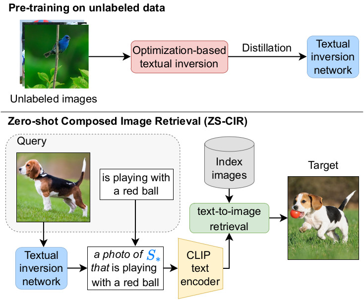
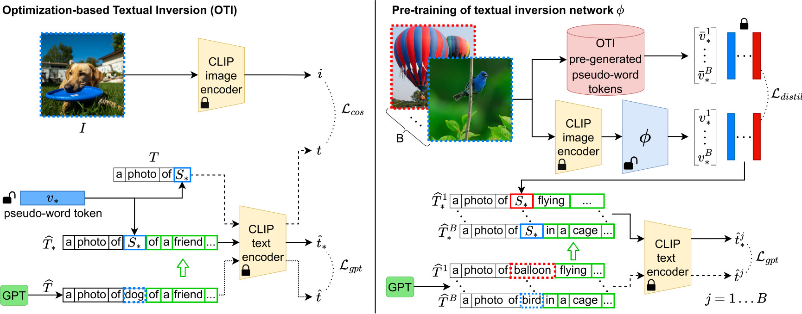

# SEARLE

### Zero-shot Composed Image Retrieval With Textual Inversion
This repository contains the code and pre-trained models for zero-**S**hot compos**E**d im**A**ge **R**etrieval with textua**L** inv**E**rsion (**SEARLE**).

For more details please see our [paper](#) - **Zero-shot Composed Image Retrieval With Textual Inversion**.

>You are currently viewing the code and model repository. If you are looking for more information about the newly-proposed dataset **CIRCO** see the [repository](https://github.com/miccunifi/CIRCO).

## Table of Contents

* [About the Project](#about-the-project)
* [Authors](#authors)
* [Acknowledgements](#acknowledgements)

## About The Project

### Workflow of the method

Workflow of our method. *Top*: in the pre-training phase, we generate pseudo-word tokens of unlabeled images with an optimization-based textual inversion and then distill their knowledge to a textual inversion network. *Bottom*: at inference time on ZS-CIR, we map the reference image to a pseudo-word $S_*$ and concatenate it with the relative caption. Then, we use CLIP text encoder to perform text-to-image retrieval.

### Overview of the proposed approach

Overview of our approach. *Left*: we generate a pseudo-word token $v_*$ from an image $I$ with an iterative optimization-based textual inversion. We force $v_*$ to represent the content of the image with a cosine loss $\mathcal{L}_{cos}$.
We assign a concept word to $I$ with a CLIP zero-shot classification and feed the prompt ``a photo of \{concept\}" to GPT to continue the phrase, resulting in $\widehat{T}$. Let $S_*$ be the pseudo-word associated with $v_*$, we build $\widehat{T}_*$ by replacing in $\widehat{T}$ the concept with $S_*$. $\widehat{T}$ and $\widehat{T}_*$ are then employed for a contextualized regularization with $\mathcal{L}_{gpt}$. *Right*: we train a textual inversion network $\phi$ on unlabeled images. Given a set of pseudo-word tokens pre-generated with OTI, we distill their knowledge to $\phi$ through a contrastive loss $\mathcal{L}_{distil}$. We regularize the output of $\phi$ with the same GPT-powered loss $\mathcal{L}_{gpt}$ employed in OTI. B represents the number of images in a batch.

### Abstract
Composed Image Retrieval (CIR) aims to retrieve a target image based on a query composed of a reference image and a relative caption that describes the difference between the two images. The high effort and cost required for labeling datasets for CIR hamper the widespread usage of existing methods, as they rely on supervised learning. In this work, we propose a new task, Zero-Shot CIR (ZS-CIR), that aims to address CIR without requiring a labeled training dataset. Our approach, named zero-Shot composEd imAge Retrieval with textuaL invErsion (SEARLE), maps the visual features of the reference image into a pseudo-word token in CLIP token embedding space and integrates it with the relative caption. To support research on ZS-CIR, we introduce an open-domain benchmarking dataset named Composed Image Retrieval on Common Objects in context (CIRCO), which is the first dataset for CIR containing multiple ground truths for each query. The experiments show that SEARLE exhibits better performance than the baselines on the two main datasets for CIR tasks, FashionIQ and CIRR, and on the proposed CIRCO.

## Authors

* [**Alberto Baldrati**](https://scholar.google.com/citations?hl=en&user=I1jaZecAAAAJ)**\***
* [**Lorenzo Agnolucci**](https://scholar.google.com/citations?user=hsCt4ZAAAAAJ&hl=en)**\***
* [**Marco Bertini**](https://scholar.google.com/citations?user=SBm9ZpYAAAAJ&hl=en)
* [**Alberto Del Bimbo**](https://scholar.google.com/citations?user=bf2ZrFcAAAAJ&hl=en)

**\*** Equal contribution. Author ordering was determined by coin flip.

## Acknowledgements
This work was partially supported by the European Commission under European Horizon 2020 Programme, grant number 101004545 - ReInHerit.