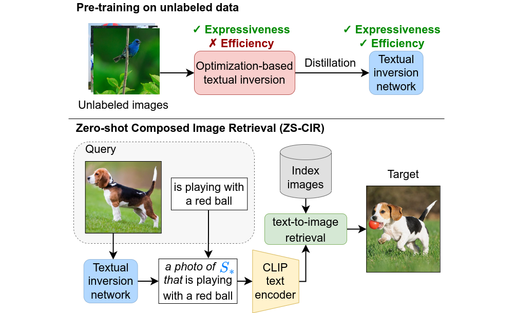

# SEARLE (ICCV 2023)

### Zero-shot Composed Image Retrieval With Textual Inversion

[](https://arxiv.org/abs/2303.15247)
[](https://circo.micc.unifi.it/demo)
[](https://www.youtube.com/watch?v=qxpNb9qxDQI)
[](/assets/Slides.pptx)
[](/assets/Poster.pdf)
[](https://github.com/miccunifi/SEARLE)

🔥🔥 **[2024/05/07] The extended version of our ICCV 2023 paper is now public: [iSEARLE: Improving Textual Inversion for Zero-Shot Composed Image Retrieval
](https://arxiv.org/abs/2405.02951). The code will be released upon acceptance.**

This is the **official repository** of the [**ICCV 2023 paper**](https://arxiv.org/abs/2303.15247) "*Zero-Shot Composed
Image Retrieval with Textual Inversion*" and its [**extended version**](https://arxiv.org/abs/2405.02951) "*iSEARLE: Improving Textual Inversion for Zero-Shot Composed Image Retrieval*".
 
> You are currently viewing the code and model repository. If you are looking for more information about the
> newly-proposed dataset **CIRCO** see the [repository](https://github.com/miccunifi/CIRCO).

## Overview

### Abstract

Composed Image Retrieval (CIR) aims to retrieve a target image based on a query composed of a reference image and a
relative caption that describes the difference between the two images. The high effort and cost required for labeling
datasets for CIR hamper the widespread usage of existing methods, as they rely on supervised learning. In this work, we
propose a new task, Zero-Shot CIR (ZS-CIR), that aims to address CIR without requiring a labeled training dataset. Our
approach, named zero-Shot composEd imAge Retrieval with textuaL invErsion (SEARLE), maps the visual features of the
reference image into a pseudo-word token in CLIP token embedding space and integrates it with the relative caption. To
support research on ZS-CIR, we introduce an open-domain benchmarking dataset named Composed Image Retrieval on Common
Objects in context (CIRCO), which is the first dataset for CIR containing multiple ground truths for each query. The
experiments show that SEARLE exhibits better performance than the baselines on the two main datasets for CIR tasks,
FashionIQ and CIRR, and on the proposed CIRCO.



Workflow of our method. *Top*: in the pre-training phase, we generate pseudo-word tokens of unlabeled images with an
optimization-based textual inversion and then distill their knowledge to a textual inversion network. *Bottom*: at
inference time on ZS-CIR, we map the reference image to a pseudo-word $S_*$ and concatenate it with the relative
caption. Then, we use CLIP text encoder to perform text-to-image retrieval.

## Citation
```bibtex
@article{agnolucci2024isearle,
  title={iSEARLE: Improving Textual Inversion for Zero-Shot Composed Image Retrieval}, 
  author={Agnolucci, Lorenzo and Baldrati, Alberto and Bertini, Marco and Del Bimbo, Alberto},
  journal={arXiv preprint arXiv:2405.02951},
  year={2024},
}
```

```bibtex
@inproceedings{baldrati2023zero,
  title={Zero-Shot Composed Image Retrieval with Textual Inversion},
  author={Baldrati, Alberto and Agnolucci, Lorenzo and Bertini, Marco and Del Bimbo, Alberto},
  booktitle={Proceedings of the IEEE/CVF International Conference on Computer Vision},
  pages={15338--15347},
  year={2023}
}
```

<details>
<summary><h2>Getting Started</h2></summary>

We recommend using the [**Anaconda**](https://www.anaconda.com/) package manager to avoid dependency/reproducibility
problems.
For Linux systems, you can find a conda installation
guide [here](https://docs.conda.io/projects/conda/en/latest/user-guide/install/linux.html).

### Installation

1. Clone the repository

```sh
git clone https://github.com/miccunifi/SEARLE
```

2. Install Python dependencies

```sh
conda create -n searle -y python=3.8
conda activate searle
conda install -y -c pytorch pytorch=1.11.0 torchvision=0.12.0
pip install comet-ml==3.33.6 transformers==4.24.0 tqdm pandas==1.4.2
pip install git+https://github.com/openai/CLIP.git
```

### Data Preparation

#### FashionIQ

Download the FashionIQ dataset following the instructions in
the [**official repository**](https://github.com/XiaoxiaoGuo/fashion-iq).

After downloading the dataset, ensure that the folder structure matches the following:

```
├── FashionIQ
│   ├── captions
|   |   ├── cap.dress.[train | val | test].json
|   |   ├── cap.toptee.[train | val | test].json
|   |   ├── cap.shirt.[train | val | test].json

│   ├── image_splits
|   |   ├── split.dress.[train | val | test].json
|   |   ├── split.toptee.[train | val | test].json
|   |   ├── split.shirt.[train | val | test].json

│   ├── images
|   |   ├── [B00006M009.jpg | B00006M00B.jpg | B00006M6IH.jpg | ...]
```

#### CIRR

Download the CIRR dataset following the instructions in the [**official repository**](https://github.com/Cuberick-Orion/CIRR).

After downloading the dataset, ensure that the folder structure matches the following:

```
├── CIRR
│   ├── train
|   |   ├── [0 | 1 | 2 | ...]
|   |   |   ├── [train-10108-0-img0.png | train-10108-0-img1.png | ...]

│   ├── dev
|   |   ├── [dev-0-0-img0.png | dev-0-0-img1.png | ...]

│   ├── test1
|   |   ├── [test1-0-0-img0.png | test1-0-0-img1.png | ...]

│   ├── cirr
|   |   ├── captions
|   |   |   ├── cap.rc2.[train | val | test1].json
|   |   ├── image_splits
|   |   |   ├── split.rc2.[train | val | test1].json
```

#### CIRCO

Download the CIRCO dataset following the instructions in the [**official repository**](https://github.com/miccunifi/CIRCO).

After downloading the dataset, ensure that the folder structure matches the following:

```
├── CIRCO
│   ├── annotations
|   |   ├── [val | test].json

│   ├── COCO2017_unlabeled
|   |   ├── annotations
|   |   |   ├──  image_info_unlabeled2017.json
|   |   ├── unlabeled2017
|   |   |   ├── [000000243611.jpg | 000000535009.jpg | ...]
```

#### ImageNet

Download ImageNet1K (ILSVRC2012) test set following the instructions in
the [**official site**](https://image-net.org/index.php).

After downloading the dataset, ensure that the folder structure matches the following:

```
├── ImageNet1K
│   ├── test
|   |   ├── [ILSVRC2012_test_[00000001 | ... | 00100000].JPEG]
```
</details>

<details>
<summary><h2>SEARLE Inference with Pre-trained Models</h2></summary>

### Validation

To compute the metrics on the validation set of FashionIQ, CIRR or CIRCO using the SEARLE pre-trained models, simply run
the following command:

```sh
python src/validate.py --eval-type [searle | searle-xl] --dataset <str> --dataset-path <str>
```

```
    --eval-type <str>               if 'searle', uses the pre-trained SEARLE model to predict the pseudo tokens;
                                    if 'searle-xl', uses the pre-trained SEARLE-XL model to predict the pseudo tokens, 
                                    options: ['searle', 'searle-xl']           
    --dataset <str>                 Dataset to use, options: ['fashioniq', 'cirr', 'circo']
    --dataset-path <str>            Path to the dataset root folder
     
    --preprocess-type <str>         Preprocessing type, options: ['clip', 'targetpad'] (default=targetpad)
```
Since we release the pre-trained models via torch.hub, the models will be automatically downloaded when running the inference script.

The metrics will be printed on the screen.

### Test

To generate the predictions file for uploading on the [CIRR Evaluation Server](https://cirr.cecs.anu.edu.au/) or
the [CIRCO Evaluation Server](https://circo.micc.unifi.it/) using the SEARLE pre-trained models,
please execute the following command:

```sh
python src/generate_test_submission.py --submission-name <str>  --eval-type [searle | searle-xl] --dataset <str> --dataset-path <str>
```

```
    --submission-name <str>         Name of the submission file
    --eval-type <str>               if 'searle', uses the pre-trained SEARLE model to predict the pseudo tokens;
                                    if 'searle-xl', uses the pre-trained SEARLE-XL model to predict the pseudo tokens, 
                                    options: ['searle', 'searle-xl']           
    --dataset <str>                 Dataset to use, options: ['cirr', 'circo']
    --dataset-path <str>            Path to the dataset root folder
    
    --preprocess-type <str>         Preprocessing type, options: ['clip', 'targetpad'] (default=targetpad)
```
Since we release the pre-trained models via torch.hub, the models will be automatically downloaded when running the inference script.

The predictions file will be saved in the `data/test_submissions/{dataset}/` folder.
</details>

<details>
<summary><h2>SEARLE Minimal Working Example</h2></summary>

```python
import torch
import clip
from PIL import Image

# set device
device = "cuda" if torch.cuda.is_available() else "cpu"

image_path = "path to image to invert"  # TODO change with your image path
clip_model_name = "ViT-B/32"  # use ViT-L/14 for SEARLE-XL

# load SEARLE model and custom text encoding function
searle, encode_with_pseudo_tokens = torch.hub.load(repo_or_dir='miccunifi/SEARLE', source='github', model='searle',
                                                   backbone=clip_model_name)
searle.to(device)

# load CLIP model and preprocessing function
clip_model, preprocess = clip.load(clip_model_name)

# NOTE: the preprocessing function used to train SEARLE is different from the standard CLIP preprocessing function. Here,
# we use the standard one for simplicity, but if you want to reproduce the results of the paper you should use the one
# provided in the SEARLE repository (named targetpad)

# preprocess image and extract image features
image = preprocess(Image.open(image_path)).unsqueeze(0).to(device)
image_features = clip_model.encode_image(image).float()

# use SEARLE to predict the pseudo tokens
extimated_tokens = searle(image_features.to(device))

# define a prompt (you can use any prompt you want as long as it contains the $ token)
prompt = "a photo of $"  # The $ is a special token that will be replaced with the pseudo tokens

# encode the prompt with the pseudo tokens
tokenized_prompt = clip.tokenize([prompt]).to(device)
text_features = encode_with_pseudo_tokens(clip_model, tokenized_prompt, extimated_tokens)

# compute similarity
similarity = (100.0 * torch.cosine_similarity(image_features, text_features))
print(f"similarity: {similarity.item():.2f}%")
```
</details>

<details>
<summary><h2>SEARLE</h2></summary>

This section provides instructions for reproducing the results of the SEARLE method.
It covers the steps to train the textual inversion network and perform inference using the trained model.

### 0. GPT phrases generation

To perform both the optimization-based textual inversion and the training of the textual inversion network phi, we need to generate
a set of phrases for each concept in the dictionary. The concepts are taken from
the [Open Images V7 dataset](https://storage.googleapis.com/openimages/web/index.html).

Run the following command to generate the phrases:

```sh
python src/gpt_phrases_generation.py
```

```
    --exp-name <int>                Name of the experiment (default="GPTNeo27B")
    --gpt-model <str>               GPT model to use (default="EleutherAI/gpt-neo-2.7B")
    --max-length <int>              Maximum length of the generated phrases (default=35)
    --num-return-sequences <int>    Number of generated phrases for each concept (default=256)
    --temperature <float>           Temperature of the sampling (default=0.5)
    --no-repeat-ngram-size <int>    Size of the n-gram to avoid repetitions (default=2)
    --resume-experiment<store true> Resume the experiment if it exists (default=false)
```

Since the phrase generation process can be time-consuming, you can download the pre-generated phrases used in our
experiments [**here**](https://github.com/miccunifi/SEARLE/releases/download/weights/GPTNeo27B.zip). After downloading, unzip the file in the `data/GPT_phrases` folder so that the
folder structure matches the following: `data/GPT_phrases/GPTNeo27B/concept_to_phrases.pkl`

### 1. Image concepts association

We associate to each image a set of textual concepts taken from
the [Open Images V7 dataset](https://storage.googleapis.com/openimages/web/index.html).

Run the following command to associate concepts with the images:

```sh
python src/image_concepts_association.py --clip-model-name <str> --dataset imagenet --dataset-path <str> --split test
```

```
    --clip-model-name <str>        CLIP model to use, e.g 'ViT-B/32', 'ViT-L/14'
    --dataset-path <str>           Path to the ImageNet root folder
    --batch-size <int>             Batch size (default=32)
    --num-workers <int>            Number of workers (default=8)
    --preprocess-type <str>        Preprocessing type, options: ['clip', 'targetpad'] (default=targetpad)
```

The associations will be saved in a CSV file located in the `data/similar_concept/imagenet/test` folder.

### 2. Optimization-based Textual Inversion (OTI)

Perform the Optimization-based Textual Inversion on the ImageNet test set.

Run the following command to perform OTI:

```sh
python src/oti_inversion.py --exp-name <str> --clip-model-name <str> --dataset imagenet --dataset-path <str> --split test  
```

```
    --exp-name <str>                Name of the OTI experiment
    --clip-model-name <str>         CLIP model to use, e.g 'ViT-B/32', 'ViT-L/14'
    --dataset-path <str>            Path to the ImageNet root folder
    --gpt-exp-name <str>            Name of the GPT generation phrases experiment (should be the same as --exp-name in step 0)
                                    (default=GPTNeo27B)
    --learning-rate <float>         Learning rate (default=2e-2)
    --weight-decay <float>          Weight decay (default=0.01)
    --batch-size <int>              Batch size (default=32)
    --preprocess-type <str>         Preprocessing type, options: ['clip', 'targetpad'] (default=targetpad)
    --top-k <int>                   Number of concepts associated to each image (default=15)
    --oti-steps <int>               Number of steps for OTI (default=350)
    --lambda_gpt <float>            Weight of the GPT loss (default=0.5)
    --lambda_cos <float>            Weight of the cosine loss (default=1)
    --ema-decay <float>             Decay for the exponential moving average (default=0.99)
    --save-frequency <int>          Saving frequency expressed in batches (default=10)
    --resume-experiment<store true> Resume the experiment if it exists (default=false)
    --seed <int>                    Seed for the random number generator (default=42)
```

The OTI pre-inverted-tokens will be saved in the `data/oti_pseudo_tokens/imagenet/test/{exp_name}` folder.

### 3. Textual Inversion Network Training

Finally, train the Textual Inversion Network by distilling the knowledge from the OTI pre-inverted-tokens.

It is recommended to have a properly initialized Comet.ml account to have better logging of the metrics
(nevertheless, all the metrics will also be logged on a csv file).

To train the Textual Inversion Network, run the following command:

```sh
python src/train_phi.py --exp-name <str> --clip-model-name <str> --imagenet-dataset-path <str> --cirr-dataset-path <str> --oti-exp-name <str> --save-training 
```

```
    --exp-name <str>                Name of the experiment
    --clip-model-name <str>         CLIP model to use, e.g 'ViT-B/32', 'ViT-L/14'
    --imagenet-dataset-path <str>   Path to the ImageNet dataset root folder
    --cirr-dataset-path <str>       Path to the CIRR dataset root folder
    --oti-exp-name <str>            Name of the ImageNet OTI tokens experiment (should be the same as --exp-name in step 2)
    --gpt-exp-name <str>            Name of the GPT generation phrases experiment (should be the same as --exp-name in step 0)
                                    (default=GPTNeo27B)
    --preprocess-type <str>         Preprocessing type, options: ['clip', 'targetpad'] (default=targetpad)
    --phi-dropout <float>           Dropout for the Textual Inversion Network (default=0.5)
    --batch-size <int>              Phi training batch size (default=256)
    --num-workers <int>             Number of workers (default=10)
    --learning-rate <float>         Learning rate (default=1e-4)
    --weight-decay <float>          Weight decay (default=0.01)
    --num-epochs <int>              Number of epochs (default=100)
    --lambda-distil <float>         Weight of the distillation loss (default=1)
    --lambda-gpt <float>            Weight of the GPT loss (default=0.75)
    --temperature <float>           Temperature for the distillation loss (default=0.25)
    --validation-frequency <int>    Validation frequency expressed in epochs (default=1)
    --save-frequency <int>          Saving frequency expressed in epochs (default=5)
    --save-training <store_true>    Whether save the model checkpoints or not
    --top-k-concepts <int>          Number of concepts associated to each image (default=150)
    --api-key <str>                 API key for Comet (default=None)
    --workspace <str>               Workspace for Comet (default=None)
    --seed <int>                    Seed for the random number generator (default=42)
```

The Textual Inversion Network checkpoints will be saved in the `data/phi_models/{exp_name}` folder.

### 4a. Val Set Evaluation

To evaluate the Textual Inversion Network on the validation sets, run the following command:

```sh
python src/validate.py --exp-name <str> --eval-type phi --dataset <str> --dataset-path <str> --phi-checkpoint-name <str>
```

```
    --exp-name <str>                Name of the experiment (should be the same as --exp-name in step 3)
    --dataset <str>                 Dataset to use, options: ['fashioniq', 'cirr', 'circo']
    --dataset-path <str>            Path to the dataset root folder
    --phi-checkpoint-name <str>     Name of the Textual Inversion Network checkpoint, e.g. 'phi_20.pt'   
    --preprocess-type <str>         Preprocessing type, options: ['clip', 'targetpad'] (default=targetpad)
```

The metrics will be printed on the screen.

### 4b. Test Set Evaluation

To generate the predictions file to be uploaded on the [CIRR Evaluation Server](https://cirr.cecs.anu.edu.au/) or on the
[CIRCO Evaluation Server](https://circo.micc.unifi.it/) run the following command:

```sh
python src/generate_test_submission.py --submission-name <str> --exp-name <str> --eval-type phi --dataset <str> --dataset-path <str> --phi-checkpoint-name <str> 
```

```
    --submission-name <str>         Name of the submission file
    --exp-name <str>                Name of the experiment (should be the same as --exp-name in step 3)
    --dataset <str>                 Dataset to use, options: ['cirr', 'circo']
    --dataset-path <str>            Path to the dataset root folder
    --phi-checkpoint-name <str>     Name of the Textual Inversion Network checkpoint, e.g. 'phi_20.pt'   
    --preprocess-type <str>         Preprocessing type, options: ['clip', 'targetpad'] (default=targetpad)
```

The predictions file will be saved in the `data/test_submissions/{dataset}/` folder.
</details>

<details>
<summary><h2>SEARLE-OTI</h2></summary>

This section provides instructions on reproducing the SEARLE-OTI experiments, which involve performing
Optimization-based Textual Inversion (OTI) directly on the benchmark datasets.

### 0. GPT phrases generation

Please refer to [step 0](https://github.com/miccunifi/SEARLE#0-gpt-phrases-generation) of the SEARLE section for the instructions on how to generate the GPT phrases.

### 1. Image concepts association

We associate to each image a set of textual concepts taken from
the [Open Images V7 dataset](https://storage.googleapis.com/openimages/web/index.html)

Run the following command to associate concepts with the images:

```sh
python src/image_concepts_association.py --clip-model-name <str> --dataset <str> --dataset-path <str> --split <str> --dataset-mode relative
```

```
    --clip-model-name <str>         CLIP model to use, e.g 'ViT-B/32', 'ViT-L/14'
    --dataset <str>                 Dataset to use, options: ['fashioniq', 'cirr', 'circo']
    --dataset-path <str>            Path to the dataset root folder
    --split <str>                   Dataset split to use, options: ['val', 'test']
    --batch-size <int>              Batch size (default=32)
    --num-workers <int>             Number of workers (default=8)
    --preprocess-type               Preprocessing type, options: ['clip', 'targetpad'] (default=targetpad)
```

The associations will be saved in a CSV file located in the `data/similar_concept/{dataset}/{split}` folder.

### 2. Optimization-based Textual Inversion (OTI)

Perform Optimization-based Textual Inversion on the benchmark datasets.

Run the following command to perform OTI:

```sh
python src/oti_inversion.py --exp-name <str> --clip-model-name <str> --dataset <str> --dataset-path <str> --split <str>   
```

```
    --exp-name <str>                Name of the OTI experiment
    --clip-model-name <str>         CLIP model to use, e.g 'ViT-B/32', 'ViT-L/14'
    --dataset <str>                 Dataset to use, options: ['fashioniq', 'cirr', 'circo']
    --dataset-path <str>            Path to the dataset root folder
    --split <str>                   Dataset split to use, options: in ['val', 'test']
    --gpt-exp-name <str>            Name of the GPT generation phrases experiment (should be the same as --exp-name in step 0)
                                    (default=GPTNeo27B)
    --learning-rate <float>         Learning rate (default=2e-2)
    --weight-decay <float>          Weight decay (default=0.01)
    --batch-size <int>              Batch size (default=32)
    --preprocess-type <str>         Preprocessing type, options: ['clip', 'targetpad'] (default=targetpad)
    --top-k <int>                   Number of concepts associated to each image (default=15)
    --oti-steps <int>               Number of steps for OTI (default=350)
    --lambda_gpt <float>            Weight of the GPT loss (default=0.5)
    --lambda_cos <float>            Weight of the cosine loss (default=1)
    --ema-decay <float>             Decay for the exponential moving average (default=0.99)
    --save-frequency <int>          Saving frequency expressed in batches (default=10)
    --resume-experiment<store true> Resume the experiment if it exists (default=false)
    --seed <int>                    Seed for the random number generator (default=42)
```

The OTI pre-inverted-tokens will be saved in the `data/oti_pseudo_tokens/{dataset}/{split}/{exp_name}` folder.

### 3a. Validation Set Evaluation (split=val)

To evaluate the performance of the OTI pre-inverted tokens on the validation set, run the following command:

```sh
python src/validate.py --exp-name <str> --eval-type oti --dataset <str> --dataset-path <str> 
```

```
    --exp-name <str>                Name of the experiment (should be the same as --exp-name in step 2)
    --dataset <str>                 Dataset to use, options: ['fashioniq', 'cirr', 'circo']
    --dataset-path <str>            Path to the dataset root folder
    --preprocess-type <str>         Preprocessing type, options: ['clip', 'targetpad'] (default=targetpad)
```

The metrics will be printed on the screen.

### 3b. Test Set Evaluation (split=test)

To generate the predictions file for uploading on the [CIRR Evaluation Server](https://cirr.cecs.anu.edu.au/) or
the [CIRCO Evaluation Server](https://circo.micc.unifi.it/) using the OTI inverted tokens,
please execute the following command:

```sh
python src/generate_test_submission.py --submission-name <str> --exp-name <str> --eval-type oti --dataset <str> --dataset-path <str>
```

```
    --submission-name <str>         Name of the submission file
    --exp-name <str>                Name of the experiment (should be the same as --exp-name of step 2
    --dataset <str>                 Dataset to use, options: ['cirr', 'circo']
    --dataset-path <str>            Path to the dataset root folder
    --preprocess-type <str>         Preprocessing type, options: ['clip', 'targetpad'] (default=targetpad)
```

The predictions file will be saved in the `data/test_submissions/{dataset}/` folder.
</details>

## Authors

* [**Alberto Baldrati**](https://scholar.google.com/citations?hl=en&user=I1jaZecAAAAJ)**\***
* [**Lorenzo Agnolucci**](https://scholar.google.com/citations?user=hsCt4ZAAAAAJ&hl=en)**\***
* [**Marco Bertini**](https://scholar.google.com/citations?user=SBm9ZpYAAAAJ&hl=en)
* [**Alberto Del Bimbo**](https://scholar.google.com/citations?user=bf2ZrFcAAAAJ&hl=en)

**\*** Equal contribution. Author ordering was determined by coin flip.

## Acknowledgements

This work was partially supported by the European Commission under European Horizon 2020 Programme, grant number
101004545 - ReInHerit.

## LICENSE
<a rel="license" href="http://creativecommons.org/licenses/by-nc/4.0/"></a><br />All material is made available under [Creative Commons BY-NC 4.0](https://creativecommons.org/licenses/by-nc/4.0/). You can **use, redistribute, and adapt** the material for **non-commercial purposes**, as long as you give appropriate credit by **citing our paper** and **indicate any changes** that you've made.
